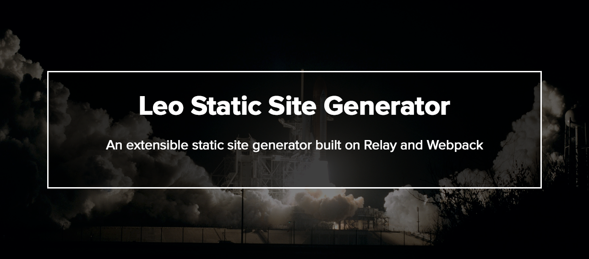
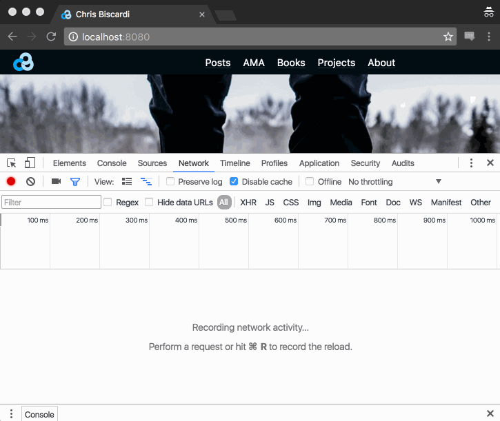

* [Why](#why)
* [Leo](#leo)
  - [Data](#data)
  - [Templates](#templates)
  - [Routing](#routing)
  - [Quick Start](#quick-start)
* [More Docs](docs)
  - [Technical Overview](docs/technical-overview.md)
  - [Plugins](docs/plugins.md)
  - [Developing](docs/developing.md)

# Why LEO?

LEO is a library for creating Static Site Generators with a common
GraphQL data layer. Typically, one would use a LEO generator to build
static sites from Single Page Applications. This is a different
approach to generators such as Jekyll and Hugo which use template
languages. See the [Comparison to Other Generators]().

You may want to choose a pre-built generator such as React from the
[Quick Start]() section.

<h4 align="center">Data</h4>

Data in LEO is exposed through a composable, extensible GraphQL
Schema defining Content Types. It can be queried with any valid
GraphQL client (such as
[Apollo](https://github.com/apollostack/apollo-client) or
[GraphiQL]() for development).

```javascript
query BlogPostPage {
  post(slug: $slug) {
    attributes { title, date, timeToRead }
    body
  }
}
```

# Why Leo?

* [GraphQL Data Layer](docs/graphql-data-layer)
* Use any UI tech (React, Glamor, Inferno, etc)
* Webpack based extensibility
* Structured Content Types (Markdown, Blogpost, Contentful)
* Reuse Component Libraries Across Client Projects

## Optional Modern Client-Side JS

Leo builds a client-side bundle using Relay which you can optionally
include when rendering .html files. Once the inital JS is downloaded,
every page can be rendered by fetching a JSON file from the same
static server. The JSON files contain the minimal set of content
required to render each URL. It is also cached, which means each
request happens only once.



# Quick Start

Leo has a number of starter projects designed to get you started
quickly.

```javascript
git clone git@github.com:superawesome/leo-blog-starter.git
cd leo-blog-starter && npm i
```

## List of Starters

* [leo-blog-starter](https://github.com/superawesomelabs/leo-blog-starter)
* leo-documentation-starter
* leo-filepath-starter
  - Shows how Leo can be used to emulate the url-from-location-on-disk
    feature of other generators

## Deployment

Leo can deploy to [surge.sh](http://surge.sh/), [GitHub
Pages](https://pages.github.com/) and anywhere else using [deployment
plugins](#deployment).

# Themes

Themes are bundles of React Components and Content Types. For example,
a Theme can provide the Components required to render various forms of
BlogPosts (individual view, generic list view, archive view, etc).

Themes can depend on multiple Content Types. This makes it possible to
scale a theme from a single Blog Post to an entire site (including
aggregate pages, such as a landing page).

# Developing Leo

Leo is [lerna-based](https://github.com/lerna/lerna).

## Deploying

Ideally, this would run off of
[lerna-semantic-release](https://github.com/atlassian/lerna-semantic-release). Until
then, here are the commands to run to deploy new lerna versions.

```
./node_modules/.bin/lerna bootstrap
./node_modules/.bin/lerna run dist
./node_modules/.bin/lerna deploy
```

[react]: https://facebook.github.io/react/
[react-router]: https://github.com/reactjs/react-router
